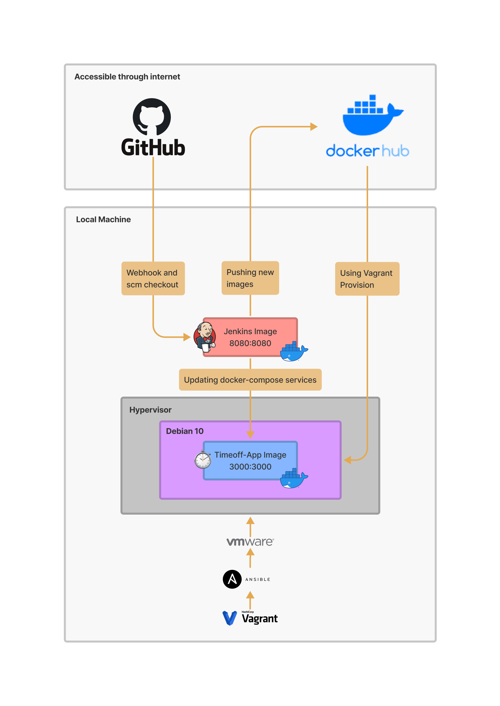

# TimeOff.Management - Release Manager Challenge
Web application for managing employee absences with automatic deployment using VMware, Vagrant, Ansible, Jenkins and GitHub.

- [TimeOff.Management - Release Manager Challenge](#timeoffmanagement---release-manager-challenge)
  - [Architecture](#architecture)
  - [Requirements](#requirements)
  - [TimeOff.Management Application](#timeoffmanagement-application)
      - [Building the Docker Image](#building-the-docker-image)
      - [Running the Docker Image](#running-the-docker-image)
  - [Vagrant](#vagrant)
      - [Deployment with Vagrant](#deployment-with-vagrant)
      - [Destroy Vagrant running machine](#destroy-vagrant-running-machine)
  - [Ansible](#ansible)
  - [Jenkins](#jenkins)
      - [Configuring Jenkins](#configuring-jenkins)
      - [Running Jenkins with Docker Compose](#running-jenkins-with-docker-compose)
  - [Localtunnel](#localtunnel)
      - [Using Localtunnel](#using-localtunnel)
  - [Github Webhook](#github-webhook)

## Architecture


---
## Requirements
- Docker >= 20.10.13 (For [timeoff-app](timeoff-app/README.md) local testing)
- Docker Compose >= v2.3.3
- VMware Fusion >= 12.1.0
- Vagrant >= 2.2.19

## TimeOff.Management Application
Has the contents of [timeoff-management/timeoff-management-application](https://github.com/timeoff-management/timeoff-management-application) at the time of forking the repository.

#### Building the Docker Image
```bash
docker build --pull --no-cache -f timeoff-app/Dockerfile -t timeoff-app-demo:latest timeoff-app/
```
> **Note:** Docker flags `--pull --no-cache` are used to prevent any cache from base image and Docker layer during local development/tests.

#### Running the Docker Image
```bash
docker run --rm -d -p 3000:3000 --name timeoff-app-demo timeoff-app-demo:tagname
```
> **Note:** Docker run `tagname` parameter should be replaced with `latest` or the name of the tag to be run.

## Vagrant
#### Deployment with Vagrant
Using the Vagrantfile you just need to `vagrant up` and everything for the Debian 10 virtualization layer is installed and configured for you to work with the TimeOff.Management Application.

#### Destroy Vagrant running machine
This command stops the running machine Vagrant is managing and destroys all resources that were created during the machine creation process. 
```bash
vagrant destroy --force debian10
```

## Ansible
For manual Ansible execution and testing in the Vagrant Debian 10 VM.
```bash
cd ansible
ansible-playbook docker-install.yml
ansible-playbook run-timeoff-container.yml
```
> **Note:** These commands can be replaced executing `vagrant provision` directly on the root directory, but the Ansible approach helps test individual notebooks and particular changes.


## Jenkins
#### Configuring Jenkins 
- [TechWorld with Nana - Jenkins Tutorial](https://www.youtube.com/playlist?list=PLy7NrYWoggjw_LIiDK1LXdNN82uYuuuiC)
- [Docker inside Docker for Jenkins](https://itnext.io/docker-inside-docker-for-jenkins-d906b7b5f527)
- [Jenkins GitHub WebHooks](https://www.youtube.com/watch?v=ZiHMsEKklKQ)

#### Running Jenkins with Docker Compose
```bash
docker-compose up -d
```
> **Note:** The Jenkins service can take several minutes while getting ready to use, I recommend using `docker-compose up` without the detached mode for being able to track the service status easily and not depend on the web browser.

## Localtunnel
[Localtunnel](https://localtunnel.github.io/www/) allows you to easily share a web service on your local development machine without messing with DNS and firewall settings.
Localtunnel will assign you a unique publicly accessible url that will proxy all requests to your locally running webserver.

#### Using Localtunnel
```bash
lt --subdomain release-manager --port 8080
```
**Localtunnel execution example**


> **Note:** Localtunnel is a simple way for tunneling local machine Jenkins service and expose it.

## Github Webhook
Jenkins Pipeline `pipelineTimeOffCICD` will allow push events/notifications from GitHub Webhook to trigger the Jenkins job.

**Jenkins CI/CD strategy includes:**
- Docker Hub login
- TimeOff Build - Docker Publish Steps (Build and Publish Artifacts)
- TimeOff Deployment - Docker Compose Update and Clean

**Jenkins execution with GitHub Webhook on `master` branch**
